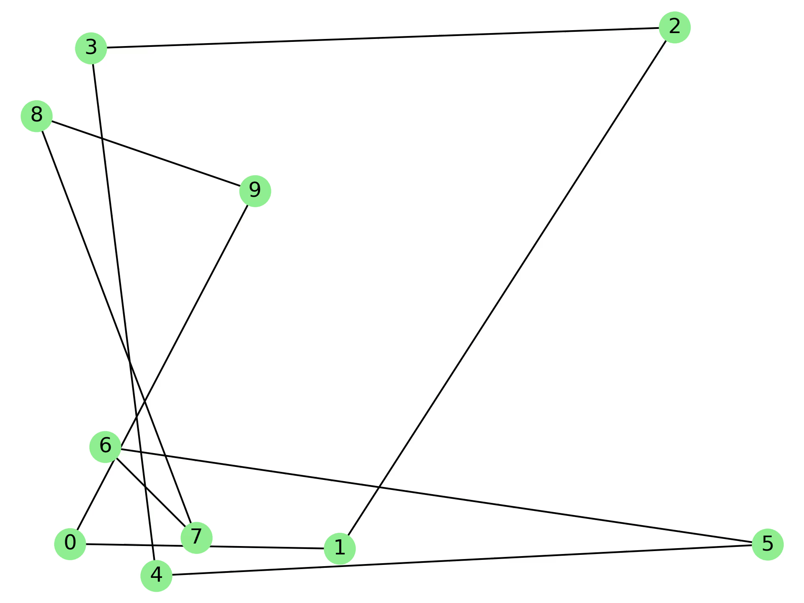
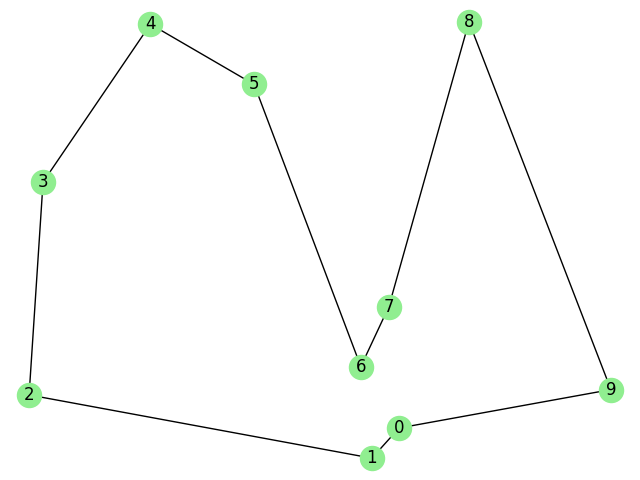
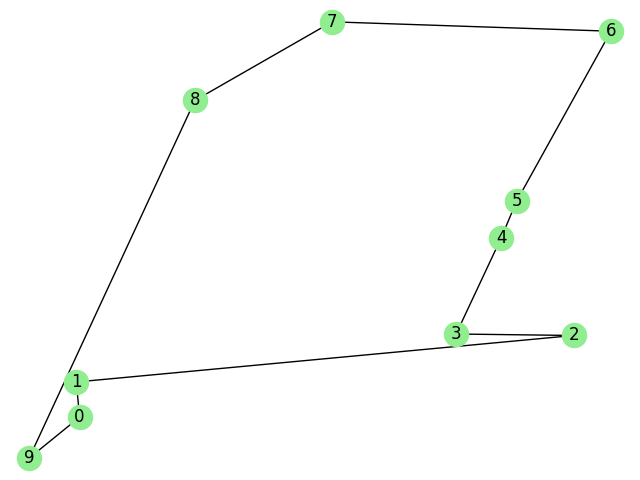

# Travelling Salesman Problem

## Description

In this repository, the **Travelling Salesman Problem** or *TSP* is addressed with a variety of approaches. 
 
 
| Project Specifications 	|                                          	|
|------------------------	|------------------------------------------	|
|                    IDE 	| Visual Studio 2019 Version 16.7.2        	|
|   Programming Language 	| C++ 17                                   	|
|       Operating System 	| Windows 10                               	|
|               Compiler 	| Intel Compiler 19.1                      	|
|       Extra Frameworks 	| OpenMP 4.0                               	|
|              Processor 	| Intel(R) Core(TM) i7-9750H CPU @ 2.60GHz 	|
|                    RAM 	| 16 GB 2667 MHz                           	|
 
 
 

---
### 1. Naive TSP
---

The first approach is a naive yet efficient approach: 

> Consider a radnom TSP tour
>
> Repeat:
>> Select 2 random cities from that tour
>>
>> Permutate them
>>
>> Compute new cost
>>
>> If cost was worse:
>>
>>> Permutate those cities to their initial order
>
> Until all cities are explored 
 
 

---
### 2. Heinritz - Hsiao
---
The second approach is an implementation of the *Heinritz - Hsiao* algorithm:

> Place the travelling salesman on a city
>
> Repeat:
>> Select the closest city
>>
>> Update the path
>>
> Until all cities have been explored
 
 

---
### 3. Naive Heinritz - Hsiao
---
The third implementation is a variation of the above algorithm:

> Place the travelling salesman on a city
>
> Repeat:
>> Find the closest city
>>
>> Find the second closest city
>>
>> Randomly select between those two options
>>
>> Update the path
>>
> Until all cities have been explored
 
 

---
### 4. Ant Colony Optimization
---
The fourth and final approach uses the *Ant Colony Optimization* algorithm:

> Place `N` ants on `N` random cities
> Repeat:
>> For each ant repeat:
>>
>>> Compute the cost for each possible edge
>>>
>>> Fetch each edge's past pherormone
>>>
>>> Use roulette wheel and select an edge
>>>
>>> Update path
>>>
>>> Leave some pherormone on the selected edge
>>>
>> Until `ant memory limit` is reached
>>
>> Vaporize a pherormone percentage globally
>>
> Until `M` number of iterations have been completed
>
> Pick the best edge based on the `pherormone matrix` and make a TSP tour
 
 

---
## Notes

There is also a parallel implementation for each of the first, the third and the fourth approach using OpenMP 4.0. 

## Installation

* Open a terminal
* Clone the repository `git clone https://github.com/andreasceid/tsp.git`
* Change directory using `cd tsp`
* [Optional] Make any desired changes in `Common.h` header file
* Compile the project using `make`
* Execute the project using `./tsp`

## Results

The GIF below is illustrates the progress of the *Naive TSP* algorithm approach for 10 cities:

The next images show sample outputs of the *ACS* algorithm for 10 cities:

## Performance

For the parallel implementations, using the Intel VTUNE profiler, the following results came up:

* For the parallel implementation of the *Naive TSP*:  

* For the parallel implementation of the *Naive Heinritz - Hsiao*:  

* For the parallel implementation of the *ACS*:  

## Research Stats

Comparing the different algorithms with some fixed data, there were some interesting results attached below:

|        Algorithm       	| Performance (10 cities fixed dataset) 	|         TSP tour cost        	|
|:----------------------:	|:-------------------------------------:	|:----------------------------:	|
|        Naive TSP       	|            0.02773 seconds            	| 4500 (mean of 10 executions) 	|
|    Heinritz - Hsiao    	|            0.04765 seconds            	|           3116.622           	|
| Naive Heinritz - Hsiao 	|            0.02859 seconds            	| 4000 (mean of 10 executions) 	|
|           ACS          	|            0.07339 seconds            	| 3800 (mean of 10 executions) 	|

However, with random data, the ACS shows better results regarding the cost function.

## Data Visualization

To visualize the results and the progress of those algorithms, *[another](https://github.com/andreasceid/csv2networkx)* repository was created. Using that repository, the result data in `./data` project directory can be moved to the input directory of that project and monitor the algorithms' results. 
